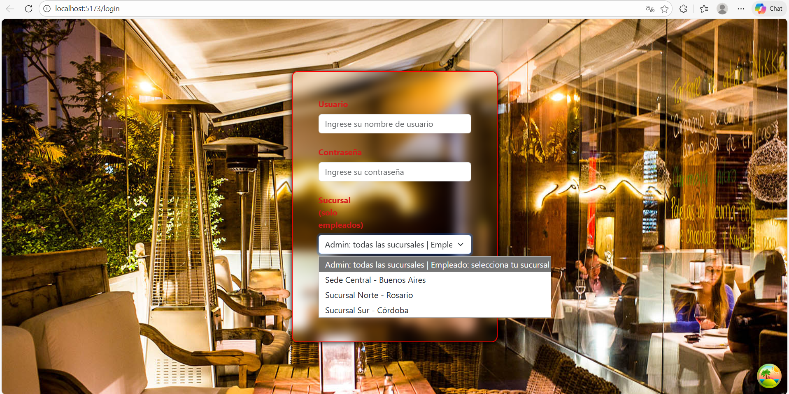

# 🍗 Food Control POS - Sistema de Gestión de Ventas

> Sistema de punto de venta (POS) moderno desarrollado con React para gestión integral de rotiserías y restaurantes

[](https://reactjs.org/)
[](https://vitejs.dev/)
[](https://github.com/pmndrs/zustand)
[](https://tanstack.com/query/latest)

> **⚠️ Nota Importante:** Este es un sistema para **restaurantes/rotiserías**, NO para consultorios médicos.  
> **¿Buscas un sistema médico?** → [Ver recomendaciones aquí](./RECOMENDACIONES-CONSULTORIO-MEDICO.md)

---

## 📋 Sobre el Proyecto

**Food Control POS** es una aplicación web frontend desarrollada con **React 18** y arquitectura moderna, diseñada para simplificar la gestión de ventas, inventario y empleados en negocios gastronómicos.

Este proyecto implementa las mejores prácticas de desarrollo frontend moderno con una arquitectura escalable basada en features.

---

## ✨ Características Principales

### 🔐 Autenticación y Roles
- ✅ Login seguro con validación de credenciales
- ✅ Sistema de roles (Administrador / Empleado)
- ✅ Permisos diferenciados por rol
- ✅ Selección de sucursal para empleados

### 📦 Gestión de Productos
- ✅ CRUD completo de productos
- ✅ Importación masiva desde Excel
- ✅ Categorización y asociación con proveedores
- ✅ Control de stock por sucursal

### 🛒 Sistema de Ventas
- ✅ Carrito de compras interactivo
- ✅ Múltiples métodos de pago
- ✅ Registro de ventas por empleado
- ✅ Historial completo de transacciones

### 👥 Administración
- ✅ Gestión de empleados y permisos
- ✅ Control de categorías y proveedores
- ✅ Administración de sucursales
- ✅ WebSocket para actualizaciones en tiempo real

---

## 📸 Capturas de Pantalla

### 🔐 Pantalla de Login

*Sistema de autenticación con selección de sucursal y roles*

### 📊 Dashboard - Gestión de Ventas

*Vista principal del sistema de ventas con carrito interactivo*

### 📦 Administración de Productos

*Gestión completa de productos con importación Excel*

---

## 🛠️ Stack Tecnológico

### Core
- **React 18** - Librería UI con hooks modernos
- **Vite 5** - Build tool ultra-rápido
- **React Router 6** - Enrutamiento SPA

### Estado y Datos
- **Zustand** - Estado global reactivo con persistencia
- **React Query (TanStack Query)** - Cache inteligente y sincronización
- **Axios** - Cliente HTTP con interceptores

### UI/UX
- **React Bootstrap** - Componentes UI responsivos
- **SweetAlert2** - Alertas y notificaciones elegantes
- **Socket.IO Client** - WebSocket para tiempo real

---

## ⚡ Instalación Rápida

```bash
# 1. Clonar repositorio
git clone https://github.com/DanielCostella/GestorVentasApp.git
cd GestorVentasApp

# 2. Instalar dependencias
npm install

# 3. Iniciar en desarrollo
npm run dev

# 4. Abrir navegador
# http://localhost:5173
```

### Prerrequisitos
- Node.js 16.x o superior
- Backend API corriendo en `http://localhost:8000`

---

## 📁 Estructura del Proyecto

```
Frontend/
├── src/
│   ├── features/              # Organización por funcionalidad
│   │   ├── auth/             # Autenticación
│   │   ├── productos/        # Gestión de productos
│   │   ├── ventas/           # Sistema de ventas
│   │   └── ...               # Otras features
│   │
│   ├── stores/               # Estado global (Zustand)
│   ├── lib/                  # Configuraciones (Axios, React Query)
│   ├── Components/           # Componentes reutilizables
│   └── Pages/                # Páginas principales
│
├── public/                   # Recursos estáticos
└── README.md
```

**Arquitectura Feature-Based:**
Cada feature contiene:
- `api/` - Llamadas HTTP
- `hooks/` - Custom hooks
- `components/` - Componentes específicos

---

## 🎯 Scripts Disponibles

```bash
npm run dev          # Desarrollo (puerto 5173)
npm run build        # Build de producción
npm run preview      # Preview del build
npm run lint         # Linting de código
```

---

## 🔒 Roles y Permisos

| Funcionalidad | Admin | Empleado |
|--------------|-------|----------|
| Ver productos | ✅ | ✅ |
| Gestionar productos | ✅ | ❌ |
| Realizar ventas | ✅ | ✅ |
| Ver todas las sucursales | ✅ | ❌ |
| Gestionar empleados | ✅ | ❌ |
| Importar Excel | ✅ | ❌ |

---

## 📦 Dependencias Principales

```json
{
  "react": "^18.3.1",
  "react-router-dom": "^6.x",
  "zustand": "^5.0.3",
  "@tanstack/react-query": "^5.71.0",
  "axios": "^1.7.9",
  "react-bootstrap": "^2.10.6",
  "sweetalert2": "^11.15.2"
}
```

---

## 🏗️ Arquitectura Moderna

### Estado Global con Zustand
```javascript
import { useAuthStore } from '@/stores/authStore'

const { empleado, login, logout } = useAuthStore()
```

### Server State con React Query
```javascript
import { useProductos } from '@/features/productos/hooks/useProductos'

const { data, isLoading } = useProductos()
```

---

## 🤝 Contribuir

¡Las contribuciones son bienvenidas!

1. Fork el proyecto
2. Crea tu feature branch (`git checkout -b feature/AmazingFeature`)
3. Commit tus cambios (`git commit -m 'Add: nueva funcionalidad'`)
4. Push a la rama (`git push origin feature/AmazingFeature`)
5. Abre un Pull Request

---

## 🎯 Casos de Uso

### ✅ Este sistema ES ideal para:
- Restaurantes y rotiserías
- Cafeterías y bares
- Negocios de comida rápida
- Panaderías y pastelerías
- Cualquier negocio gastronómico con ventas y control de stock

### ❌ Este sistema NO es para:
- Consultorios médicos o clínicas → [Ver alternativas](./RECOMENDACIONES-CONSULTORIO-MEDICO.md)
- Farmacias (requiere control de medicamentos regulados)
- Veterinarias (requiere historia clínica veterinaria)
- Tiendas de retail complejas (mejor usar sistemas especializados)

---

## 📝 Roadmap

- [ ] Modo oscuro
- [ ] PWA (Progressive Web App)
- [ ] Reportes en PDF
- [ ] Tests unitarios
- [ ] Multi-idioma (i18n)

---

## 👨‍💻 Autor

**Daniel Costella**

[](https://github.com/DanielCostella)
[](https://linkedin.com/in/danielcostella)

---

## 📄 Licencia

Este proyecto está bajo la Licencia MIT.

---

⭐ **Si este proyecto te resultó útil, ¡considera darle una estrella!**
